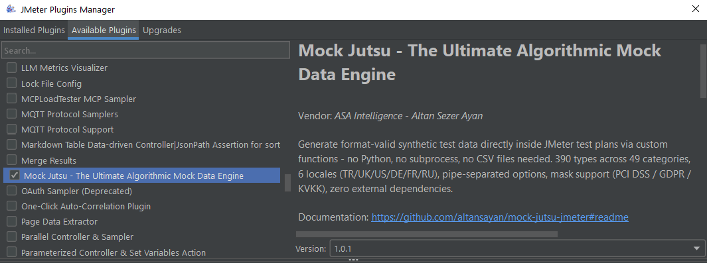
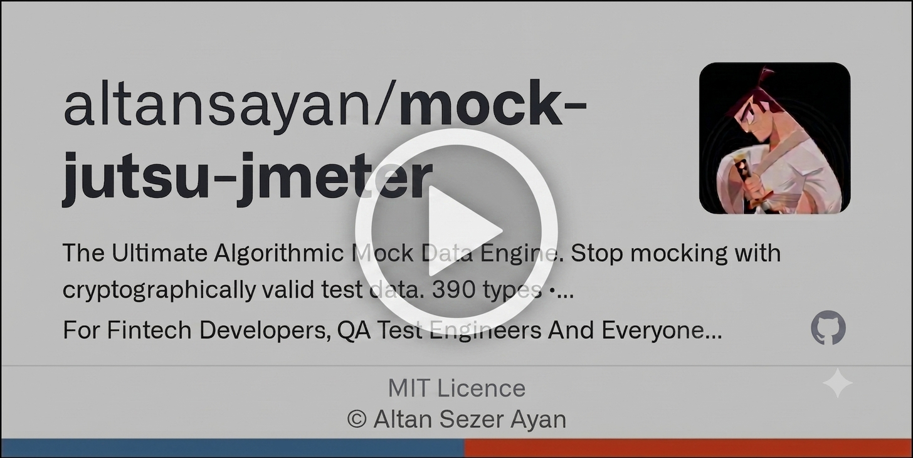

# Mock Jutsu - JMeter Plugin

[](https://github.com/altansayan/mock-jutsu-jmeter/actions)
[](https://adoptium.net)
[](https://jmeter.apache.org)
[](LICENSE)
[](https://jmeter-plugins.org/?search=mock-jutsu)

Generate **5955-tested**, format-valid synthetic test data directly inside JMeter test plans — no Python, no subprocess, no external dependencies.

```
${__mockjutsu_identity(tckn|TR)}                    → 46396909916
${__mockjutsu_financial(iban|DE)}                   → DE89370400440532013000
${__mockjutsu_financial(cardnum)}                   → 4532015112830366
${__mockjutsu_banking(swift|TR)}                    → AKBKTRIS
${__mockjutsu_mrz(mrz_td3|TR)}                      → P<TUR... (2×44 chars)
${__mockjutsu_meta(reverse_regex:[A-Z]{3}\d{4})}   → XKM7291
${__mockjutsu_financial(cardnum:visa|TR|mask)}      → 4155 56** **** 3399  (PCI DSS masked)
${__mockjutsu_financial(cardnum:visa|TR|myCard)}    → stores result in ${myCard}
```

> **DISCLAIMER — FOR TESTING PURPOSES ONLY**
> All data generated by this plugin is **algorithmically synthesized and entirely fictitious**.
> It is designed exclusively for software testing, QA automation, and load testing.
> Generated values (identity numbers, IBANs, card numbers, passport numbers, etc.) must **never** be used for fraud, identity theft, financial crime, or any other illegal activity.
> The authors accept no liability for misuse. By using this plugin you agree to these terms.

---

## Installation

### Method 1: JMeter Plugins Manager (recommended)

1. Install [Plugins Manager](https://jmeter-plugins.org/install/Install/) if you haven't already
2. In JMeter, open **Options → Plugins Manager → Available Plugins**
3. Search for `Mock Jutsu`, check it, and click **Apply Changes and Restart JMeter**

Official Plugin Page: [jmeter-plugins.org/?search=mock-jutsu](https://jmeter-plugins.org/?search=mock-jutsu)



### Method 2: Manual Installation (Function Helper Dialog)

1. Download `mock-jutsu-jmeter-1.0.1.jar` from [Releases](https://github.com/altansayan/mock-jutsu-jmeter/releases)
2. Copy to `$JMETER_HOME/lib/ext/`
3. Restart JMeter
4. Open **Options → Function Helper Dialog** — search for `mockjutsu`

---

## Usage

1. Open the Helper Docs: [altansayan.github.io/mock-jutsu-api](https://altansayan.github.io/mock-jutsu-api/)
2. Find the function you want to use
3. Copy its function snippet from the JMeter widget
4. Paste it directly into any JMeter field — no scripting needed

<p align="center">
  <a href="https://www.youtube.com/watch?v=6IEy3rCa2c0">▶️ Watch the Usage Demo on YouTube</a>
  <br>
  <a href="https://www.youtube.com/watch?v=6IEy3rCa2c0">
    
  </a>
  <br>
  <a href="https://www.youtube.com/watch?v=6IEy3rCa2c0">▶️ Watch the Usage Demo on YouTube</a>
</p>

### Syntax

Use **pipe `|`** to separate options inside the Function Helper — JMeter does not escape `|`, so the output is always clean with no backslashes.

```
${__mockjutsu_<category>(type[:qualifier][|locale][|varName][|mask])}
```

| Token | Required | Description |
|-------|----------|-------------|
| `type[:qualifier]` | Yes | Data type, optionally with a qualifier after `:` (e.g. `cardnum:visa`, `balance:100\|5000`) |
| `locale` | No | `TR` · `DE` · `FR` · `UK` · `US` · `RU` — omit for locale-agnostic types |
| `varName` | No | Any other word stores the result in a JMeter variable |
| `mask` | No | Keyword — returns a regulation-compliant masked value (PCI DSS, GDPR, KVKK…) |

> **Backward compatible:** multi-param comma style `(type,locale,varName,mask)` also works — JMeter treats each comma as a parameter separator, not an escaped value.

### Examples

```
${__mockjutsu_financial(cardnum)}                     → 4532015112830366
${__mockjutsu_financial(cardnum:visa)}                → 4532015112830366  (Visa forced)
${__mockjutsu_financial(cardnum|TR)}                  → 4532015112830366  (Turkish locale)
${__mockjutsu_financial(cardnum:visa|mask)}           → 4532 01** **** 0366  (PCI DSS masked)
${__mockjutsu_financial(cardnum:visa|TR|mask)}        → 4532 01** **** 0366
${__mockjutsu_financial(cardnum:visa|TR|myCard)}      → stores result in ${myCard}
${__mockjutsu_financial(cardnum:visa|TR|myCard|mask)} → masked + stored in ${myCard}
${__mockjutsu_meta(reverse_regex:[A-Z]{3}\d{4})}     → XKM7291
```

### Generic function (all types)

```
${__mockjutsu(tckn|TR|myVar)}
```

---

## Categories & Types

### Identity — `__mockjutsu_identity`
`tckn` `ykn` `nationalid` `vkn` `taxid` `employer_id` `insurance_id` `sgk` `mersis` `ssn` `ein` `nin` `utr` `crn` `paye` `ust_id` `hrb` `rvn` `siren` `siret` `tva` `inn` `inn_individual` `snils` `kpp` `ogrn` `vat_number` `tckn_masked` `ssn_masked` `nationality`

### Name — `__mockjutsu_identity`
`firstname` `lastname` `fullname` `patronymic`

### Demographic — `__mockjutsu_identity`
`age` `gender` `birthdate`

### Document — `__mockjutsu_identity`
`passport` `license`

### Financial — `__mockjutsu_financial`
`cardnum` `cardtype` `cardstatus` `cardcategory` `cardowner` `cardnetwork` `cvv3` `cvv4` `pin` `expiry` `expirymonth` `expiryyear` `issuer` `balance` `iban` `sepa_qr` `emv_qr_p2p` `emv_qr_atm` `emv_qr_pos` `3ds_cavv` `3ds_eci` `credit_score`

### Financial Extended — `__mockjutsu_financial_ext`
`credit_score_model` `credit_score_tier` `credit_limit` `credit_utilization` `credit_card_issuer_name` `apr` `loan_type` `mortgage_rate` `mortgage_term` `premium_amount` `deductible` `coverage_limit` `claim_status` `credit_limit_masked` `mortgage_rate_masked` `premium_amount_masked`

### Banking — `__mockjutsu_banking`
`swift` `bic` `sort_code` `routing_number` `bik_code` `bank_name` `transaction` `sepa_ref` `creditor_ref` `account_type` `transaction_type` `transaction_description` `ifsc_code` `bsb_code` `check_number` `micr_line` `payment_reference` `wire_routing_number` `account_number` `account_number_masked` `micr_line_masked` `transaction_description_masked` `check_number_masked` `payment_reference_masked`

### Payments — `__mockjutsu_payments`
`swift_mt103` `pain001` `nacha_ach` `sepa_mandate` `fedwire`

### Card Physics — `__mockjutsu_cardphysics`
`iso8583_auth_request` `iso8583_auth_response` `iso8583_reversal` `emv_arqc` `emv_atc` `emv_iad` `atm_session` `pos_receipt`

### Hardware — `__mockjutsu_hardware`
`track1_data` `track2_data` `chip_data` `pin_block` `pin_block_fmt3`

### Compliance — `__mockjutsu_compliance`
`policy_number` `claim_number` `pep_status` `aml_risk_rating` `cdd_level` `sar_number` `ubo_ownership_percentage` `kyc_document_type` `consent_id` `tpp_id` `onboarding_method` `sanctions_hit` `sar_number_masked` `policy_number_masked` `claim_number_masked` `ubo_ownership_percentage_masked` `consent_id_masked`

### Communication — `__mockjutsu_comm`
`phone` `phone_country` `phone_area` `phone_local` `address_city` `address_street` `address_full` `postalcode` `plate` `email`

### Meta — `__mockjutsu_meta`
`uuid` `requestid` `correlationid` `sessionid` `idempotencykey` `deviceid` `timestamp` `timestamp_iso` `ipv4` `ipv6` `browser_name` `browser_version` `browser_engine` `useragent` `jwt` `bearertoken` `hash` `mac_address` `url` `domain` `color` `clientversion` `signature` `apppassword` `api_key` `totp_code` `webhook_signature` `transaction_id` `public_ip` `private_ip` `reverse_regex`

> **reverse_regex with pattern:** `${__mockjutsu_meta(reverse_regex:[A-Z]{3}\d{4})}`

### Datetime — `__mockjutsu_datetime`
`past_date` `future_date` `date_between` `date_this_year` `date_this_month` `time_only` `past_datetime` `future_datetime`

### Security — `__mockjutsu_security`
`cef_log` `x509_cert` `pcap_hex` `password` `password_hash` `cve_id`

### Health — `__mockjutsu_health`
`blood_type` `nhs_number` `nhsnumber` `icd10` `bmi` `height` `weight` `npi` `hl7_message` `fhir_patient` `dicom_uid`

### Corporate — `__mockjutsu_corporate`
`company_name` `job_title` `occupation`

### Commerce — `__mockjutsu_commerce`
`currency` `tax_rate` `invoice_number` `vin` `vehicle`

### Barcode — `__mockjutsu_barcode`
`ean13` `ean8` `upca` `isbn13` `isbn10` `gs1_128`

### Telecom — `__mockjutsu_telecom`
`imei` `imei2` `iccid` `imsi` `msisdn`

### IoT / RFID / NFC / IR / Wireless — `__mockjutsu_iot`
`rfid_uid` `epc` `rfid_tag` `nfc_uid` `nfc_atqa` `nfc_sak` `ndef_uri` `ndef_text` `apdu` `nfc_tag` `ir_nec` `ir_rc5` `ir_pronto` `ir_raw` `mqtt_payload` `lora_packet`

### Location — `__mockjutsu_location`
`latitude` `longitude` `timezone` `country_code` `coordinates`

### Social — `__mockjutsu_social`
`username` `handle` `hashtag` `bio` `follower_count`

### E-Commerce — `__mockjutsu_ecommerce`
`product_name` `sku` `order_id` `tracking_number` `dhl_tracking` `category` `rating`

### Capital Markets — `__mockjutsu_markets`
`isin` `cusip` `sedol` `lei` `fix_message` `psd2_consent` `stock_ticker` `figi` `forex_pair` `forex_rate` `ric` `mic` `stock_exchange` `option_contract` `bond_yield` `coupon_rate` `settlement_date` `portfolio_id` `portfolio_id_masked` `nsin`

### Crypto — `__mockjutsu_crypto`
`btc_address` `eth_address` `crypto_address` `tx_hash` `block_hash` `mnemonic` `nft_token_id` `gas_price` `gas_limit` `defi_protocol_name` `blockchain_network` `wallet_label` `defi_position_type` `cryptocurrency_name` `liquidity_pool_id` `liquidity_pool_id_masked`

### Web3 Wallets — `__mockjutsu_wallet`
`eth_wallet` `btc_wallet` `sol_wallet`

### FIDO2 / WebAuthn — `__mockjutsu_fido2`
`webauthn_credential` `fido2_assertion`

### OIDC / JWT — `__mockjutsu_oidc`
`oidc_token_set` `jwks` `oidc_token`

### AI & Vector — `__mockjutsu_ai`
`ai_embedding` `ai_vector` `ai_sparse_vector`

### Aviation & Maritime — `__mockjutsu_aviation`
`iata_ticket` `imo_number` `pnr_code`

### Automotive — `__mockjutsu_automotive`
`can_frame` `obd2_response`

### MRZ — `__mockjutsu_mrz`
`mrz_td3` `mrz_td1`

### NMEA GPS — `__mockjutsu_nmea`
`nmea_gpgga` `nmea_gprmc`

### OHLCV / Market Data — `__mockjutsu_ohlcv`
`ohlcv_candles` `market_tick`

### Bank Statement — `__mockjutsu_bank_statement`
`mt940` `camt053`

### EDI — `__mockjutsu_edi`
`edi_850` `edifact_orders`

### Event Sourcing — `__mockjutsu_event_sourcing`
`event_stream` `cdc_event`

### Telemetry / FDR — `__mockjutsu_telemetry`
`fdr_record` `drone_telemetry`

### Prometheus — `__mockjutsu_prometheus`
`prometheus_metrics` `openmetrics_snapshot`

### Game Dev — `__mockjutsu_gamedev`
`quaternion` `navmesh_path`

### UBL / E-Invoice — `__mockjutsu_ubl`
`ubl_invoice` `xmldsig`

### Satellite / TLE — `__mockjutsu_tle`
`tle_satellite`

### Web — `__mockjutsu_web`
`slug` `http_method` `http_status_code` `port_number` `hostname` `tld` `uri_path`

### International IDs — `__mockjutsu_intl_ids`
`br_cpf` `br_cnpj` `in_pan` `in_aadhaar` `in_gstin` `in_epic` `cn_ric` `mx_curp` `mx_rfc` `it_codicefiscale` `es_dni` `es_nie` `es_ccc` `de_idnr` `de_stnr` `pk_cnic` `jp_cn` `jp_in` `kr_rrn` `kr_brn` `nl_bsn` `pl_pesel` `se_personnummer` `dk_cpr` `fi_hetu` `no_fodselsnummer` `au_abn` `au_tfn` `au_acn` `my_nric` `th_pin` `th_tin` `sg_uen` `za_idnr` `ca_bn` `nz_ird` `ar_cuit` `ar_dni` `cl_rut` `co_nit` `il_idnr` `ro_cnp` `ro_cui` `hr_oib` `bg_egn` `lt_asmens` `ee_ik` `pt_cc` `eg_tn`

### Pen Test — `__mockjutsu_pentest`
`jwt_attack` `asn1_fuzz`

---

## Real-World Examples

### HTTP Request body with dynamic TCKN + IBAN
```
{
  "citizenId": "${__mockjutsu_identity(tckn|TR)}",
  "iban": "${__mockjutsu_financial(iban|TR)}",
  "cardNumber": "${__mockjutsu_financial(cardnum|TR|card)}",
  "requestId": "${__mockjutsu_meta(uuid|rid)}"
}
```

### Regulation-compliant masked output
```
{
  "maskedCard": "${__mockjutsu_financial(cardnum:visa|TR|mask)}",
  "maskedTckn": "${__mockjutsu_identity(tckn|TR|mask)}",
  "maskedIban": "${__mockjutsu_financial(iban|TR|mask)}"
}
```

### Storing and reusing values
```
// Generate once, reuse everywhere
${__mockjutsu_identity(tckn|TR|myTckn)}

// Later in the same request or another sampler:
${myTckn}
```

### Reverse Regex — generate any pattern
```
${__mockjutsu_meta(reverse_regex:[A-Z]{3}\d{4})}     → XKM7291
${__mockjutsu_meta(reverse_regex:\d{2}/\d{2}/\d{4})} → 14/07/2026
${__mockjutsu_meta(reverse_regex:[A-Fa-f0-9]{8})}    → 3f8a1c2d
```

### Multi-locale load test
```
${__mockjutsu_identity(ssn|US)}     // US Social Security Number
${__mockjutsu_identity(nin|UK)}     // UK National Insurance Number
${__mockjutsu_identity(tckn|TR)}    // Turkish Citizen ID
${__mockjutsu_financial(iban|DE)}   // German IBAN (MOD-97 valid)
```

### International ID load test
```
${__mockjutsu_intl_ids(br_cpf)}     // Brazil CPF
${__mockjutsu_intl_ids(in_aadhaar)} // India Aadhaar
${__mockjutsu_intl_ids(cn_ric)}     // China Resident ID
${__mockjutsu_intl_ids(kr_rrn)}     // South Korea RRN
```

---

## Algorithm Guarantees

All generated data passes real checksum and format validation:

| Type | Algorithm |
|------|-----------|
| TCKN | d9/d10 Turkish checksum |
| IBAN | MOD-97 (ISO 13616) |
| Card numbers | Luhn |
| IMEI | Luhn |
| NHS Number | Modulo 11 |
| EAN-13/8 | GS1 checksum |
| ISIN | Luhn (alphanumeric) |
| MRZ | ICAO Doc 9303 composite check digit |
| NMEA | XOR checksum |
| PIN Block | ISO 9564-1 Format 0 & 3 |
| ISO 8583 | Pre-computed bitmaps |
| ABA Routing | Modulo 10 |
| BTC Address | Base58Check (SHA256d) |
| ETH Address | Keccak-256 EIP-55 |
| CUSIP | Modulo 10 weighted |
| LEI | MOD-97 (ISO 17442) |

---

## Building from Source

```bash
git clone https://github.com/altansayan/mock-jutsu-jmeter.git
cd mock-jutsu-jmeter/jmeter-plugin
mvn test          # 5955 tests
mvn package       # produces target/mock-jutsu-jmeter-1.0.0.jar
```

**Requirements:** Java 17+, Maven 3.8+

---

## Related Projects

- [mock-jutsu](https://github.com/altansayan/mock-jutsu-api) — Python SDK + REST API + CLI, 390 types, same algorithms

---

## ⚖️ Legal Disclaimer

Generated data is **entirely synthetic** and for development/testing environments only.

- Do not submit to real financial, government, or telecom production systems.
- Generated IBANs, card numbers, and national IDs are mathematically valid but **do not belong to real entities**.

---

<div align="center">

## 💖 Support Mock Jutsu

Mock Jutsu is **free and open-source**. If it saved you hours of test data setup, consider buying me a coffee ☕

> _"Every cup of coffee = one more data type."_ 🥷

| Network | Address |
|---------|---------|
| Ξ **Ethereum (ETH)** | `0x8D2fF0a795E3a19D41758Cb9b4451C39D528BbAF` |

_This section will be updated with our sponsors._

---

**If mock-jutsu saved you from debugging a "valid-looking but broken" test ID, please leave a ⭐!**

Released under the [MIT License](LICENSE) • Copyright © 2026 [Altan Sezer Ayan — A.S.A](https://github.com/altansayan)

</div>
